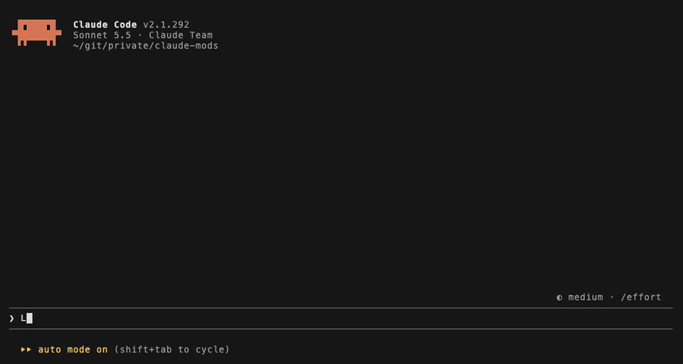

# clawd-wander

Claude が作業している間、プロンプトの上で Clawd がうろうろする。
サブエージェントが動くと、1 体ごとに種類も色も違う仲間（おばけ・ロボット・宇宙人・キノコ・恐竜・ネコ）が増える。
現れるときと消えるときは、ふわっと出入りする。
作業が終わると跳ね、ツールが失敗すると驚き、手が止まると居眠りする。編集中はハンマー、調べ物中は虫めがね、新しく書くときは鉛筆、仲間を呼ぶときは旗、待ちを始めるときは砂時計、テスト中はフラスコを持つ。
ときどき仲間が Clawd のあとを一列についていく。Clawd がひとりのときは、ときどきひとり遊び（波乗り・蝶々を追いかける）をする。
テストが通ると紙吹雪が降り、会話が圧縮（`/compact`）されている間はぺしゃんこにつぶれて、終わるとぽよんと戻る。



- ターミナルのみ（Claude Code 2.1.287 以降）
- プロンプト上の帯に描くほかの mod と一緒に使うと、その mod が表示している間はマスコットが隠れることがあるため注意

## 設定

`/config` の clawd-wander の欄で変えられる。値を変えると mod が読み直され、マスコットは出し直しになる。

| 項目 | 内容 | 既定 |
| --- | --- | --- |
| `doze_seconds` | ツールを使わない時間がこの秒数続くと居眠りする | 60 |
| `prop_seconds` | ツールを使い終えてから道具を持ち続ける秒数 | 10 |
| `play` | Clawd がひとりのとき、ときどきひとり遊び（波乗り・蝶々）をする（間隔はランダムで、平均およそ 1 分に 1 回） | オン |

秒数はどちらも 1〜3600 の範囲で指定する。範囲外の値は既定値として扱う。

## この mod がすること・しないこと

すること:

- フックするイベントは 4 つ: `ui.render`（プロンプト上の帯 `AbovePrompt` に絵を描く）、`tool.call`（ツール名・呼び出し元のエージェント・Bash のコマンドと成否を見て、持つ道具と居眠り・驚き・紙吹雪を決める）、`agent.spawn`（サブエージェントの仲間を増やす）、`session.compact`（会話の圧縮の始まりと終わりを見て、マスコットをつぶす・戻す）
- 使うエンジンの機能: `$.agent.list`（動いているサブエージェントの一覧。1 秒ごと）、`$.clock`（100 ms ごとのタイマー）、`$.ui.blit`・`$.ui.invalidate`・`$.ui.resolve`（帯の描画）

しないこと:

- ツールの呼び出しや会話の圧縮を止めたり、書き換えたりしない。結果もそのまま返す
- 通信しない。ファイルを読み書きしない。コマンドを実行しない
- 見たコマンドやエージェントの情報を保存・送信しない（道具を決めたら捨てる）

`claude plugin validate clawd-wander` を実行すると、フックするイベントと呼ぶ機能を確かめられる。

## 開発

```bash
claude plugin validate clawd-wander
claude plugin test clawd-wander
```

振る舞いの仕様はリポジトリ直下の `.scratch/` にある。
README の GIF は [vhs](https://github.com/charmbracelet/vhs) で撮っている。撮り直す手順は `screenshots/clawd-wander.tape` の冒頭にある。
