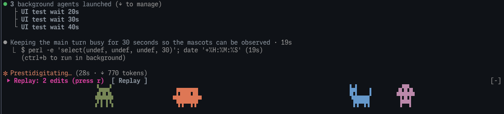

# clawd-wander

Claude が作業している間、プロンプトの上で Clawd がうろうろする。
サブエージェントが動くと、1 体ごとに種類も色も違う仲間（おばけ・ロボット・宇宙人・キノコ・恐竜・ネコ）が増える。
現れるときと消えるときは、ふわっと出入りする。
作業が終わると跳ね、ツールが失敗すると驚き、手が止まると居眠りする。編集中はハンマー、調べ物中は虫めがねを持つ。



- ターミナルのみ（Claude Code 2.1.287 以降）
- プロンプト上の帯に描くほかの mod と一緒に使うと、その mod が表示している間はマスコットが隠れることがあるため注意

## 開発

```bash
claude plugin validate clawd-wander
claude plugin test clawd-wander
```

振る舞いの仕様はリポジトリ直下の `.scratch/` にある。
